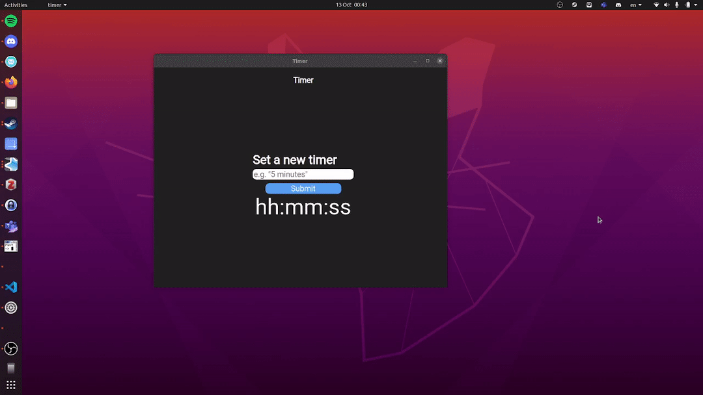

# timer-app
An open source cross-platform (Windows/macOS/linux) timer app
written in [Electron.js](https://www.electronjs.org/)

## FAQ
* **Why would I use this timer app over other timer apps?**
    * The first point I would mention is that this app is open source, which can be a big selling point if you care about that or are tech-savy and want to contribute to or modify the code in any way. Yes there are a lot of open source timer apps, that's why I mention some other points here too
    * The app is cross-platform, which narrows down the number of options out there down quite a bit, but still there are quite a few left.
    * The app is minimalistic, no bloated ui or features you don't need. This ensures the app is always fast and reliable, and a small file size too
    * You can type in phrases like `1 hour and 30 minutes` and the app will set a timer for 1 hour and 30 minutes accordingly, or you can use formats like `hh:mm:ss`. This is in my opinion a much better experience than the standard thing you get where you have to manually specify the number of hours, minutes, and seconds with sliders etc.
    * The app is not intrusive except when the timer ends, when it plays a soft alert sound and brings itself to the foreground to notify you, but it doesn't use any kind of notifications. There is no data collection of any kind, and also no need to create some sort of account. One part of the project's vision is that any intrusive feature like playing a sound when the timer ends should be toggleable even if the developer thinks that 'obviously the user is going to want this feature'.
* **I'm encountering an error, or the program doesn't work as expected. What do I do?**
Please open an issue on this github repo or contact me at [christoffer.corfield@gmail.com](mailto:christoffer.corfield@gmail.com).

* **Is there really not a windows version? Isn't the app supposed to be available for macOS, linux, *and* windows?**
Currently I have not been available to compile the app to a windows binary from my linux setup. So unfortunately, if you are on windows, there is no option other than to compile the source code yourself. In the future I would like to fix the issue preventing compilation for windows from linux from working.

## Installation instructions
* mac and linux users:
    * Download zip from
      [Releases](https://github.com/christofferaakre/timer-app/releases). Mac
users should download the file whose name contains the word `darwin`.
    * Unzip archive
    * Run executable file
* windows users:
    * Compile from source according to dev instructions below. in the future
      I would like to compile windows binaries from my linux setup, but at the
moment it is not working, so unfortunatel you will have to compile the source code yourself

## Development goals/vision
* The app should be minimalistic, not bloated. However,
customisability is a good thing, not a bad thing.
* User friendly, simple to use UI
* Intrusive only when it needs to be, i.e. when a timer ends, to play a sound and focus itself. But even these features should be toggleable
* Equal functionality across Windows, MacOS and linux
* 100% open-source forever
* Please feel free to submit issues or pull requests!

## Usage
* Enter the desired length of your timer into the input field, and press enter or click the Submit button. Supported time formats:
  * `(h)h:(m)m:(s)s`, using any of `:.,;/\+`, or white space, as a separator. For example, `03:22:11` will set a timer for 3 hours, 22 minutes and 11 seconds. `2,5,11` will set a timer for 2 hours, 5 minutes and 11 seconds, etc.
  * You can use more human language like `5 minutes`, `2 hours and 30 minutes`, `1hr 20min`, `15 min 30 sec`, etc. You can take a look at the parsing in detail by looking at the definition of the `parseTimeInput` function in `utils.js`; the implementation is very short, and if you are familiar with regex you can very quickly understand how it works by looking at the regex variables that are defined in `utils.js`
* When the timer is finished, it will play a soft alert sound, and focus itself so the application comes to the front of your screen. You can start a new timer at anytime, regardless of whether the current timer has finished or not by pressing enter or clicking the Submit button.

## development instructions
1. Clone repository: 
`git clone https://github.com/christofferaakre/timer-app.git`

2. `cd` into directory and run `npm install`: `cd timer-app && npm install`
3. Create a directory called `out`: `mkdir out`. Otherwise, the build will likely fail when you attempt it, as it will put the executable file in the `out` directory.
3. Some useful commands for developing:
    * `npm start` - start a dev environment with `NODE_ENV=dev`, which amongst
      other things enables `electron-reload` (app automatically refreshes on file
    changes) and enables chrome dev tools which are
    otherwise disabled
    * `npm run start-prod` - Start an environment similar to what is generated by
      the build process for production. No dev tools, no `electron-reload` etc
    * `npm test` runs `jest`, which executes the unit tests for the project
    * `npm run make` - runs `electron-forge make` which produces an executable
      file. Will by default generate an executable for the current platform, but
    with options can generate for other platforms too. The executable files are located in the `out` directory, which you have to create first.
    * You can also build by running `electron-forge make` manually, and this
      allows you to specify arguments such as platform to build for. However,
you will likely need to have `electron-forge` installed globally to do so. To
install it globally, run `npm install -g electron-forge` from your terminal.
Then, to build for linux for example, run `electron-forge make --platform linux`.

## TODO
* ~~More sophisticated parsing for timer, i.e. `5 minutes`, `1 hour and 15
  minutes`, etc. should work~~ DONE
* Implement terminal-like command history, ie. hitting up and down arrow keys
  within the timer input field should navigate through timer history
* Let user change audio volume of alert
* Let user toggle audio alert on/off
* Let user toggle focus on timer end on/off
* Let user change alert sound
* Fix errors when trying to compile for windows using wine on linux. Currently
  only compiling for linux and for macos seem to work on linux, and presumably
the same will be the case for macos
